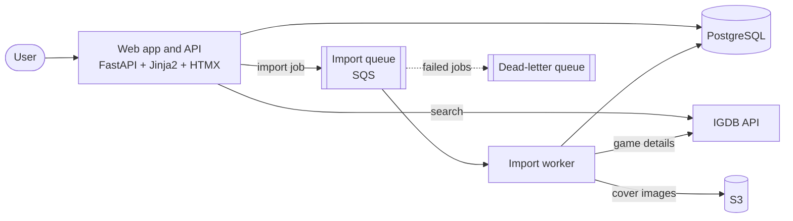
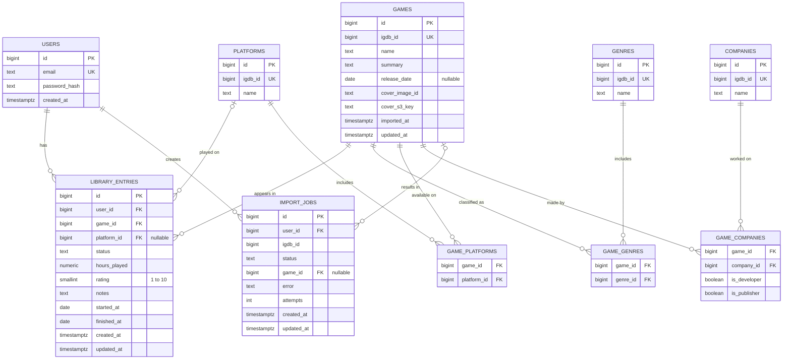

# Agora

A personal game library that automatically imports game data from IGDB and shows statistics about your gaming habits.

Add a game by name, pick the right match, and Agora fetches the cover, release date, genres, platforms and companies in the background. Then track your status, hours played, rating and notes for every game you've played.

> 🚧 **Status:** in development. See the [roadmap](#roadmap) below.

---

## Features

### Core
- **Accounts:** sign up, log in and keep a private library.
- **Add games by name:** search IGDB, choose the correct result, and the game is imported automatically in the background.
- **Library:** grid view with covers, and a detail page for each game.
- **Personal tracking:** status (playing, finished, dropped, backlog), platform, hours played, rating (1–10), start and finish dates, and notes.
- **Search and filters:** by status, genre, platform and rating, with sorting and pagination.
- **Statistics:** total hours, hours and games per genre, average rating per platform and genre, games finished per year, and a personal top 10.

### Planned extras
- Replays (multiple playthroughs of the same game)
- Custom lists
- Export to CSV / JSON
- Steam library sync

---

## Architecture

**How importing works**

1. The user searches for a game by name. The web app queries IGDB directly and shows the matching results.
2. The user picks the correct game. The web app creates an import job in the database and sends a message to the queue, then responds immediately.
3. The worker picks up the message, fetches the full game details from IGDB, normalizes the data, uploads the cover to S3, and saves everything to PostgreSQL.
4. If the game was already imported by another user, it is reused instead of imported again.
5. Failed imports are retried with backoff. Jobs that keep failing are moved to a dead-letter queue for investigation.

---

## Data model

**Key design decisions**

- **`games` vs `library_entries`:** game data is shared by all users and imported only once. Each user's experience with a game lives in `library_entries`.
- **IGDB ids everywhere:** genres, platforms and companies are matched by their IGDB id, not by name, to avoid duplicates caused by naming differences.
- **Company roles:** a game can have several developers and publishers, so companies are linked through `game_companies` with a role.
- **One entry per game per user:** `library_entries` has a unique constraint on `(user_id, game_id)`.
- **Import tracking:** `import_jobs` stores the status and number of attempts of each import, so failures can be retried and inspected.

---

## Tech stack

| Area | Technology |
|---|---|
| Language | Python |
| Web framework | FastAPI |
| Frontend | Jinja2 templates, HTMX, Chart.js |
| Database | PostgreSQL, Alembic (migrations) |
| Queue | Amazon SQS |
| File storage | Amazon S3 |
| Containers | Docker, Docker Compose |
| Local AWS emulation | LocalStack |
| Infrastructure as Code | Terraform |
| Cloud | AWS |
| CI/CD | GitHub Actions |
| Testing | pytest |
| External data | IGDB API |

---

## Roadmap

- [x] **Phase 0 — Design:** repository setup, IGDB exploration, data model and architecture
- [ ] **Phase 1 — Web app and Docker:** authentication, library management, search and filters, web pages, Docker Compose setup
- [ ] **Phase 2 — Async import pipeline:** queue, worker, IGDB integration, S3 covers, retries, idempotency, dead-letter queue
- [ ] **Phase 3 — Statistics:** SQL aggregations and charts
- [ ] **Phase 4 — AWS with Terraform:** networking, RDS, S3, SQS, ECR and compute, all as code
- [ ] **Phase 5 — CI/CD:** tests, image builds and deployments with GitHub Actions
- [ ] **Phase 6 — Observability:** structured logs, health checks and alerts

---

## Getting started

Setup instructions will be added in Phase 1.

---

## Credits

Game data provided by [IGDB](https://www.igdb.com).
