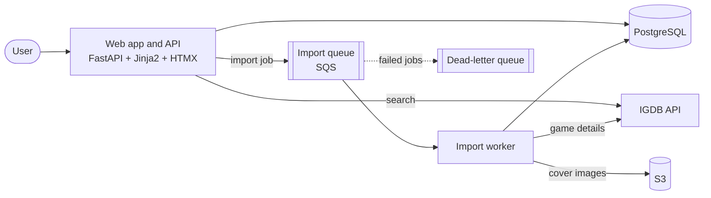
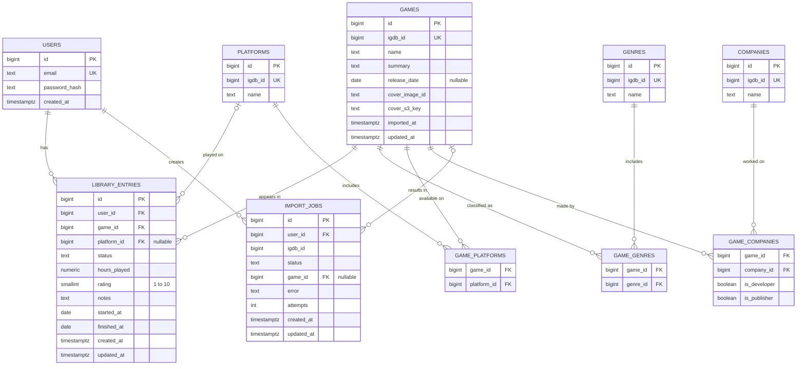

# Agora

A personal game library that automatically imports game data from IGDB and shows statistics about your gaming habits.

Add a game by name, pick the right match, and Agora fetches the cover, release date, genres, platforms and companies in the background. Then track your status, hours played, rating and notes for every game you've played.

> 🚧 **Status:** in development. Phase 1 (the web app) is complete; see the [roadmap](#roadmap) below.

---

## Features

### Core
- **Accounts:** sign up, log in and keep a private library.
- **Add games by name:** search IGDB, choose the correct result, and the game is imported automatically in the background.
- **Library:** grid view with covers, and a detail page for each game.
- **Personal tracking:** status (playing, finished, dropped, backlog), platform, hours played, rating (1–10), start and finish dates, and notes.
- **Search and filters:** by status, genre, platform and rating, with sorting and pagination.
- **Statistics:** total hours, hours and games per genre, average rating per platform and genre, games finished per year, and a personal top 10.

### Planned extras
- Replays (multiple playthroughs of the same game)
- Custom lists
- Export to CSV / JSON
- Steam library sync

---

## Architecture


```mermaid
flowchart LR
    User([User]) --> Web[Web app and API<br/>FastAPI + Jinja2 + HTMX]
    Web --> DB[(PostgreSQL)]
    Web -->|search| IGDB[IGDB API]
    Web -->|import job| Queue[[Import queue<br/>SQS]]
    Queue --> Worker[Import worker]
    Worker -->|game details| IGDB
    Worker -->|cover images| S3[(S3)]
    Worker --> DB
    Queue -.->|failed jobs| DLQ[[Dead-letter queue]]
```

**How importing works**

1. The user searches for a game by name. The web app queries IGDB directly and shows the matching results.
2. The user picks the correct game. The web app creates an import job in the database and sends a message to the queue, then responds immediately.
3. The worker picks up the message, fetches the full game details from IGDB, normalizes the data, uploads the cover to S3, and saves everything to PostgreSQL.
4. If the game was already imported by another user, it is reused instead of imported again.
5. Failed imports are retried with backoff. Jobs that keep failing are moved to a dead-letter queue for investigation.

---

## Data model


```mermaid
erDiagram
    USERS ||--o{ LIBRARY_ENTRIES : has
    USERS ||--o{ IMPORT_JOBS : creates
    GAMES ||--o{ LIBRARY_ENTRIES : "appears in"
    PLATFORMS |o--o{ LIBRARY_ENTRIES : "played on"
    GAMES ||--o{ GAME_GENRES : "classified as"
    GENRES ||--o{ GAME_GENRES : includes
    GAMES ||--o{ GAME_PLATFORMS : "available on"
    PLATFORMS ||--o{ GAME_PLATFORMS : includes
    GAMES ||--o{ GAME_COMPANIES : "made by"
    COMPANIES ||--o{ GAME_COMPANIES : "worked on"
    GAMES |o--o{ IMPORT_JOBS : "results in"

    USERS {
        bigint id PK
        text email UK
        text password_hash
        timestamptz created_at
    }

    GAMES {
        bigint id PK
        bigint igdb_id UK
        text name
        text summary
        date release_date "nullable"
        text cover_image_id
        text cover_s3_key
        timestamptz imported_at
        timestamptz updated_at
    }

    GENRES {
        bigint id PK
        bigint igdb_id UK
        text name
    }

    PLATFORMS {
        bigint id PK
        bigint igdb_id UK
        text name
    }

    COMPANIES {
        bigint id PK
        bigint igdb_id UK
        text name
    }

    GAME_GENRES {
        bigint game_id FK
        bigint genre_id FK
    }

    GAME_PLATFORMS {
        bigint game_id FK
        bigint platform_id FK
    }

    GAME_COMPANIES {
        bigint game_id FK
        bigint company_id FK
        boolean is_developer
        boolean is_publisher
    }

    LIBRARY_ENTRIES {
        bigint id PK
        bigint user_id FK
        bigint game_id FK
        bigint platform_id FK "nullable"
        text status
        numeric hours_played
        smallint rating "1 to 10"
        text notes
        date started_at
        date finished_at
        timestamptz created_at
        timestamptz updated_at
    }

    IMPORT_JOBS {
        bigint id PK
        bigint user_id FK
        bigint igdb_id
        text status
        bigint game_id FK "nullable"
        text error
        int attempts
        timestamptz created_at
        timestamptz updated_at
    }
```

**Key design decisions**

- **`games` vs `library_entries`:** game data is shared by all users and imported only once. Each user's experience with a game lives in `library_entries`.
- **IGDB ids everywhere:** genres, platforms and companies are matched by their IGDB id, not by name, to avoid duplicates caused by naming differences.
- **Company roles:** a game can have several developers and publishers, so companies are linked through `game_companies` with a role.
- **One entry per game per user:** `library_entries` has a unique constraint on `(user_id, game_id)`.
- **Import tracking:** `import_jobs` stores the status and number of attempts of each import, so failures can be retried and inspected.

---

## Tech stack

| Area | Technology |
|---|---|
| Language | Python |
| Web framework | FastAPI |
| Frontend | Jinja2 templates, HTMX, Chart.js |
| Database | PostgreSQL, Alembic (migrations) |
| Queue | Amazon SQS |
| File storage | Amazon S3 |
| Containers | Docker, Docker Compose |
| Local AWS emulation | LocalStack |
| Infrastructure as Code | Terraform |
| Cloud | AWS |
| CI/CD | GitHub Actions |
| Testing | pytest |
| External data | IGDB API |

---

## Roadmap

- [x] **Phase 0 — Design:** repository setup, IGDB exploration, data model and architecture
- [x] **Phase 1 — Web app and Docker:** authentication, library management, search and filters, web pages, Docker Compose setup
- [ ] **Phase 2 — Async import pipeline:** queue, worker, IGDB integration, S3 covers, retries, idempotency, dead-letter queue
- [ ] **Phase 3 — Statistics:** SQL aggregations and charts
- [ ] **Phase 4 — AWS with Terraform:** networking, RDS, S3, SQS, ECR and compute, all as code
- [ ] **Phase 5 — CI/CD:** tests, image builds and deployments with GitHub Actions
- [ ] **Phase 6 — Observability:** structured logs, health checks and alerts

---

## Getting started

### Prerequisites

- [Docker Desktop](https://www.docker.com/products/docker-desktop/) (includes Docker Compose)
- [Git](https://git-scm.com/)
- Python 3.11 or more recent, only needed to run the tests and the linter outside Docker
- IGDB credentials: a Client ID and a Client Secret from the [Twitch developer console](https://dev.twitch.tv/console)

### 1. Clone the repository

```bash
git clone git@github.com:MarioAfricano/Agora.git
cd Agora
```

### 2. Configure the environment

All configuration and secrets live in a `.env` file, which is never committed. Create it from the example:

```bash
cp .env.example .env              # macOS / Linux
Copy-Item .env.example .env       # Windows PowerShell
```

Then fill in the values:

| Variable | Value |
|---|---|
| `POSTGRES_USER`, `POSTGRES_PASSWORD`, `POSTGRES_DB` | Any values. Use only letters and digits in the password, because it is part of the database URL |
| `IGDB_CLIENT_ID`, `IGDB_CLIENT_SECRET` | Your Twitch application credentials |
| `SECRET_KEY` | A long random string that signs the session cookies. Generate one with `python -c "import secrets; print(secrets.token_urlsafe(32))"` |

### 3. Start the app

```bash
docker compose up -d --build
```

This builds the web image and starts two containers: `web` (FastAPI) and `db` (PostgreSQL). The web container waits until the database is healthy.

### 4. Create the database tables

The database schema is managed by Alembic migrations, which are not applied automatically. Run them once after the first start, and again whenever new migrations are added:

```bash
docker compose exec web alembic upgrade head
```

### 5. Open the app

Go to [http://localhost:8000](http://localhost:8000), create an account and search for a game to add to your library.

### Running the tests

The tests run on your machine against a separate, throwaway PostgreSQL container, so they never touch your data.

Create a virtual environment and install the dependencies:

```bash
python -m venv .venv
.venv/bin/python -m pip install -r requirements.txt -r requirements-dev.txt          # macOS / Linux
.venv\Scripts\python -m pip install -r requirements.txt -r requirements-dev.txt      # Windows
```

Start the test database. It belongs to the `test` profile, so a normal `docker compose up` does not start it:

```bash
docker compose --profile test up -d test-db
```

Run the tests:

```bash
.venv/bin/python -m pytest      # macOS / Linux
.venv\Scripts\python -m pytest  # Windows
```

### Linting and formatting

The code is checked and formatted with [Ruff](https://docs.astral.sh/ruff/):

```bash
python -m ruff check .
python -m ruff format .
```

Run them with the virtual environment's Python, as in the test commands above.

### Useful commands

| Command | What it does |
|---|---|
| `docker compose logs -f web` | Follow the web app logs |
| `docker compose exec db psql -U <POSTGRES_USER> -d <POSTGRES_DB>` | Open a SQL shell on the database |
| `docker compose exec web alembic current` | Show the applied migration |
| `docker compose down` | Stop and remove the containers (the data is kept) |
| `docker compose down -v` | Stop the containers and **delete all data** |

---

## Credits

Game data provided by [IGDB](https://www.igdb.com).
